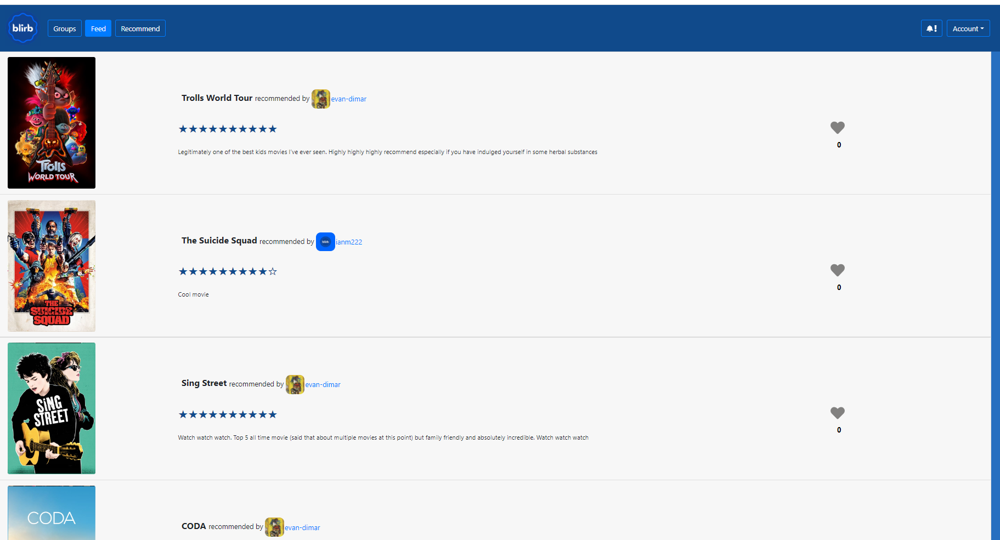
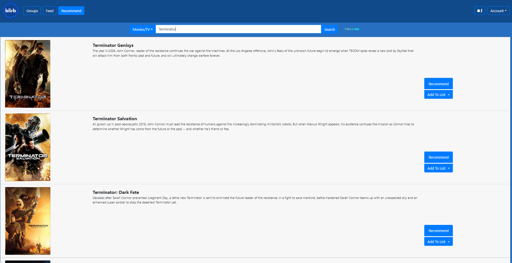
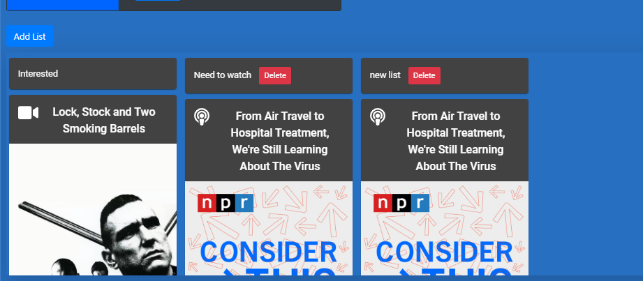
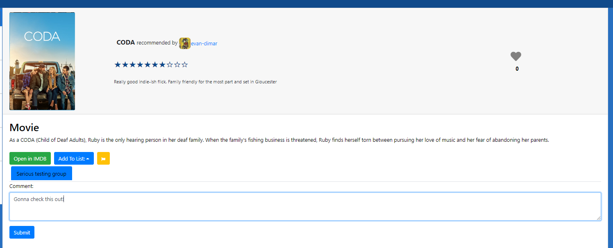

# Blirb Backend API
This is the backend code I wrote while developing www.blirb.io along with my brother and friend. I wrote all the code 
in this repo while they worked primarily on the frontend of the site. We started working on this website/ app during the 
early COVID lockdowns in March 2020 with the idea that it was too hard for friends to easily recommend eachother movies,
TV Shows, books, and Podcasts/ Podcasts episodes. The basic concept is that users have many different "groups" like they
might normally have groupchats for family, friends, work colleagues, etc. and when they watch a new movie for example,
they can easily share the details with their friends, but only the groups they decide to share with. Then a user's feed,
which functions pretty similar to an Instagram main feed, is a collection of all the media that their friends have decied to 
share with them. Example:  

## Features
* Search for movies/ tv shows/ podcasts/ podcast episodes
* Write reviews and share with friends
* Making groups/ group management
* User auth
* Liking/ commenting on posts 
* Making customized lists of contents

## Running this app locally or in production
* This project leverages a number of differnt API's that you need developer keys for: 
    * [TMDB](https://developers.themoviedb.org/3/getting-started/introduction)
    * [Spotify](https://developer.spotify.com/)
    * [Google books API](https://developers.google.com/books)
    * Once you have all the API keys sorted put them into the stubs in [blirb_secrets.py](movieWatchDjango/movieWatchDjango/blirb_secrets.py)
      * In practiec I used AWS SSM parameters to store these values, which is why that file is in Python. Make sure to not commit that to VCS
* This project saves the relevant data in an RDS database
    * You don't need to use RDS but you need to use a database obviously. Fill out the database credentials in [blirb_secrets.py](movieWatchDjango/movieWatchDjango/blirb_secrets.py) as well
* All you should need to do now is run `docker-compose up` and it should run properly. 
  * API should have no problems running on EC2 as a container or in AWS Fargate, or any other container orchestration method

## Code explanation
* This API is built on the [Django Rest Framework](https://www.django-rest-framework.org/). It is pretty heavy weight and
opinionated compared to other options, but I found it very productive to use after awhile. I tried to refactor some of 
the code as I learned best practices... There is some very DRY code like [recommendations.py](movieWatchDjango/catalogTemp/recommendations.py)
and some much more mangled code like [views.py](movieWatchDjango/catalogTemp/views.py)
* The API is fully documented in [API Endpoint Documentation](API%20Endpoint%20Documentation), this is not done to any real
standard since it was just a small team and only meant to be used internally
* The database models are all in [models.py](movieWatchDjango/catalogTemp/models.py) and the serializers are in [movieWatchAPI.py](movieWatchDjango/catalogTemp/movieWatchAPI.py)
* The API routes all in [routes.py](movieWatchDjango/catalogTemp/urls.py)

### Pictures
We ended up getting the app on Apple's testflight as a React Native app and doing an alpha with some of our friends and 
family. We ultimately decided to not pursue it any further, but we were happy with what we built and learned in the 
process:
  

